# PASD Jobsheet 5 SORTING (BUBBLE, SELECTION, DAN INSERTION SORT)

## 5.2 Praktikum 1 - Mengimplementasikan Sorting menggunakan object

## 5.2.2 Verifikasi Hasil Percobaan
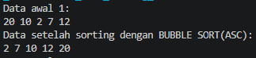
## 5.2.3 Verifikasi Hasil Percobaan
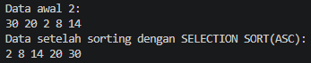
## 5.2.4 Verifikasi Hasil Percobaan
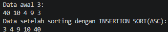

## 5.2.5 Pertanyaan!
## 1. Jelaskan fungsi kode program berikut
```java
if (data[j - 1] > data[j]) {
    temp = data[j];
    data[j] = data[j - 1];
    data[j -1 ] = temp;
}
```
Kode tersebut berfungsi untuk menukar (swap) dua elemen yang bersebelahan jika urutannya salah.
data[j - 1] > data[j] → mengecek apakah elemen kiri lebih besar dari elemen kanan.
Jika benar, maka kedua nilai ditukar menggunakan variabel sementara temp.

Langkah proses:

Simpan nilai data[j] ke temp.
Pindahkan nilai data[j-1] ke data[j].
Masukkan nilai temp ke data[j-1].
## 2. Tunjukkan kode program yang merupakan algoritma pencarian nilai minimum pada selection sort!
```java
int min = i;
for (int j = i + 1; j < jumData; j++) {
    if (data[j] < data[min]) {
        min = j;
    }
}
```
## 3. Pada Insertion sort , jelaskan maksud dari kondisi pada perulangan
```java
 while (j >= 0 && data[j] > temp)
```

Kondisi ini berarti perulangan akan terus berjalan selama:
## j >= 0
→ indeks masih berada dalam batas array.
## data[j] > temp
→ nilai yang sedang dibandingkan lebih besar dari nilai yang akan disisipkan.
Artinya:
Selama elemen di sebelah kiri lebih besar, maka elemen tersebut digeser ke kanan untuk memberi ruang bagi nilai temp.
## 4. Pada Insertion sort, apakah tujuan dari perintah 
```java
data[j + 1] = data[j];
```
Perintah ini berfungsi untuk menggeser elemen satu posisi ke kanan.
Penjelasan:
Nilai pada indeks j dipindahkan ke indeks j + 1.
Pergeseran ini dilakukan untuk membuka ruang bagi elemen temp agar dapat dimasukkan pada posisi yang benar.

## 5.3 Praktikum 2- (Sorting Menggunakan Array of Object) 

## 5.3.3 Verifikasi Hasil Percobaan
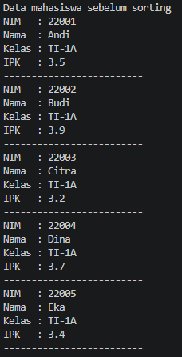
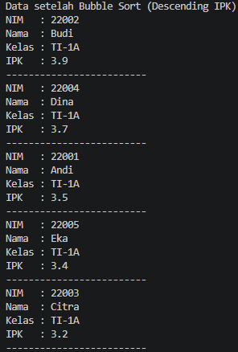

## 5.3.4 Pertanyaan
## 1.	Perhatikan perulangan di dalam bubbleSort() di bawah ini:
```java
for (int i = 0; i < listMhs.length - 1; i++) {
    for (int j = 1; j < listMhs.length - i; j++)
```
## a.	Mengapa syarat dari perulangan i adalah i<listMhs.length-1 ?
Karena proses Bubble Sort membutuhkan n-1 tahap pengurutan untuk memastikan seluruh data telah terurut. Jika jumlah data n, maka tahap maksimal yang diperlukan adalah n-1 kali perulangan.
## b.	Mengapa syarat dari perulangan j adalah j<listMhs.length-i ?
Karena setiap tahap Bubble Sort akan memindahkan nilai terbesar ke posisi paling akhir, sehingga elemen terakhir tidak perlu dibandingkan lagi pada tahap berikutnya. Oleh karena itu batas perulangan dikurangi dengan nilai i.
## c.	Jika banyak data di dalam listMhs adalah 50, maka berapakali perulangan i  akan berlangsung? Dan ada berapa Tahap bubble sort yang ditempuh?
Jika jumlah data 50, maka:

Jumlah perulangan i =
50 - 1 = 49 kali

Sehingga tahap bubble sort = 49 tahap.
## 2.	Modifikasi program diatas dimana data mahasiswa bersifat dinamis (input dari keyborad) yang terdiri dari nim, nama, kelas, dan ipk!
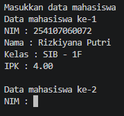

## 5.3.6 Verifikasi Hasil Percobaan
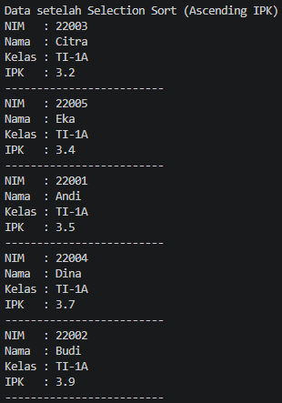

## 5.3.7 Pertanyaan
## Di dalam method selection sort, terdapat baris program seperti di bawah ini:
Untuk apakah proses tersebut, jelaskan!
Proses tersebut digunakan untuk menukar posisi elemen terkecil yang ditemukan dengan elemen pada posisi awal bagian yang belum terurut. Tujuannya adalah agar setiap tahap Selection Sort dapat menempatkan nilai terkecil pada posisi yang benar.

## 5.4.2 Verifikasi Hasil Percobaan
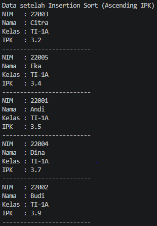

## 5.4.3 Pertanyaan
## Ubahlah fungsi pada InsertionSort sehingga fungsi ini dapat melaksanakan proses sorting dengan cara descending.
```java
void insertionSortDesc() {
    for (int i = 1; i < listMhs.length; i++) {
        Mahasiswa21 temp = listMhs[i];
        int j = i - 1;

        while (j >= 0 && listMhs[j].ipk < temp.ipk) {
            listMhs[j + 1] = listMhs[j];
            j--;
        }

        listMhs[j + 1] = temp;
    }
}
```
Perubahan terdapat pada kondisi:
```java
listMhs[j].ipk < temp.ipk
```

## Latihan Praktikum
## Fitur 1
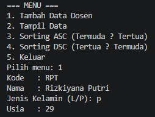
## Fitur 2
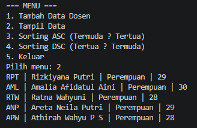
## Fitur 3
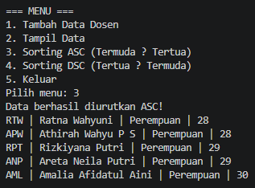
## Fitur 4
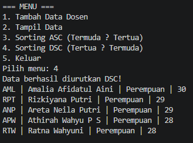